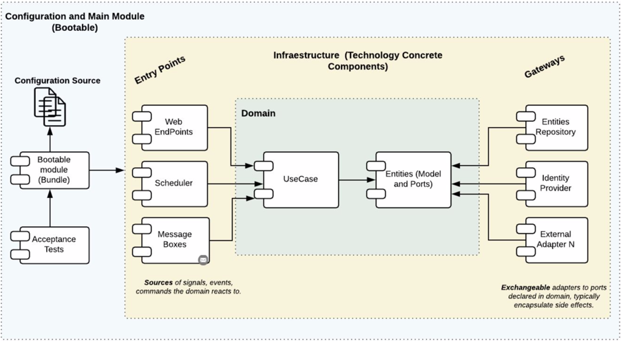

# 💳 Administracion de Tarjetas y Transacciones

API Restful para administracion de tarjetas de credito y transacciones de compra, desarrollado con Spring Boot WebFlux y arquitectura hexagonal (Clean Architecture).


## 🛠️ Stack Tecnologico

- **Java 21**
- **Spring Boot 4.0.2** (WebFlux - Reactivo)
- **R2DBC** con PostgreSQL 16
- **Gradle 9.3.0**
- **Scaffold** Clean Architecture Plugin v4.1.0
- **Jakarta Bean Validation** para validacion de inputs
- **JUnit 5 + Mockito + StepVerifier** para pruebas unitarias

## 🏗️ Arquitectura Hexagonal (Puertos y Adaptadores)


```
                    ┌──────────────────────────────────────┐
                    │           APPLICATION                │
                    │  (Ensamblaje, configuracion, beans)  │
                    └──────────────┬───────────────────────┘
                                   │
          ┌────────────────────────┼────────────────────────┐
          │                        │                        │
 ┌────────▼─────────┐   ┌─────────▼──────────┐   ┌────────▼─────────┐
 │   ENTRY POINTS    │   │      DOMAIN        │   │ DRIVEN ADAPTERS  │
 │  (reactive-web)   │   │                    │   │ (r2dbc-postgres) │
 │                   │   │  ┌──────────────┐  │   │                  │
 │  Handler          │──▶│  │  Use Cases   │  │◀──│ CardRepository   │
 │  RouterRest       │   │  │              │  │   │   Adapter        │
 │  ResponseBuilder  │   │  └──────┬───────┘  │   │                  │
 │  RestValidator    │   │         │          │   │ TransactionRepo  │
 │  Mapper           │   │  ┌──────▼───────┐  │   │   Adapter        │
 │                   │   │  │   Models     │  │   │                  │
 │  Requests/        │   │  │   Gateways   │  │   │ CardEntity       │
 │  Responses        │   │  │   Enums      │  │   │ TransactionEntity│
 └───────────────────┘   │  └──────────────┘  │   └──────────────────┘
                         └────────────────────┘
```

### 📦 Capas

**Domain (Model):** Modelos de negocio (`Card`, `Transaction`), enums de estado (`CardStatusEnum`, `TransactionStatusEnum`), interfaces de repositorio (Gateways/Ports), excepciones personalizadas (`BusinessException`) y mensajes (`MessagesEnum`).

**Domain (Use Cases):** Logica de negocio pura sin dependencias de infraestructura. Cada operacion es un caso de uso independiente:
- `CreateCardUseCase` - Genera numero de validacion (SecureRandom) e identificador (SHA-256)
- `EnrollCardUseCase` - Valida numero de validacion y cambia estado a ENROLLED
- `GetCardUseCase` - Consulta tarjeta por identificador
- `DeleteCardUseCase` - Borrado logico, cambia estado a INACTIVE
- `CreateTransactionUseCase` - Valida que la tarjeta exista y este enrolada
- `CancelTransactionUseCase` - Valida ventana de 5 minutos para anulacion
- `GetTransactionUseCase` - Consulta transaccion por referencia

**Entry Points (reactive-web):** Capa de presentacion con routing funcional de WebFlux. `Handler` orquesta las peticiones, `RestValidator` valida los DTOs con Jakarta Validation, `Mapper` convierte entre request/response y comandos/modelos.

**Driven Adapters (r2dbc-postgresql):** Implementacion de los ports/gateways del dominio. `CardRepositoryAdapter` y `TransactionRepositoryAdapter` traducen errores de infraestructura (`DataIntegrityViolationException`) a excepciones de negocio (`BusinessException`).

## ✅ Cumplimiento de Requisitos

| # | Requisito | Estado | Detalle |
|---|-----------|--------|---------|
| 1 | Crear tarjeta | ✅ | PAN, titular, cedula, tipo, telefono. Retorna validation number, PAN enmascarado, identificador |
| 2 | Enrolar tarjeta | ✅ | Valida numero de validacion, cambia estado a ENROLLED |
| 3 | Consultar tarjeta | ✅ | Retorna PAN enmascarado, titular, cedula, telefono, estado |
| 4 | Eliminar tarjeta | ✅ | Borrado logico, estado INACTIVE |
| 5 | Crear transaccion | ✅ | Valida tarjeta existente y enrolada |
| 6 | Anular transaccion | ✅ | Valida ventana de 5 minutos |
| 7 | Pruebas unitarias >= 80% | ✅ | Tests en use cases, handler, adapters con Mockito + StepVerifier |
| 8 | Auditoria en BD | ✅ | Campos `created_at` en ambas tablas, estados inmutables (CREATED->ENROLLED->INACTIVE) |
| 9 | Spring Boot | ✅ | Spring Boot 4.0.2 con WebFlux reactivo |
| 10 | Jakarta Validation | ✅ | `@NotBlank`, `@Pattern`, `@Size`, `@NotNull`, `@Positive` en todos los DTOs |
| 11 | Actuadores / Health | ✅ | `/actuator/health` habilitado con probes |
| 12 | Metodos HTTP correctos | ✅ | POST (crear), GET (consultar), PUT (enrolar/anular), DELETE (eliminar) |
| 13 | Codigos HTTP correctos | ✅ | 200, 201, 400, 404, 409, 500 |
| 14 | Excepciones personalizadas | ✅ | `BusinessException`, `CustomException` con codigos de operacion unicos |

## 🗄️ DDL - Scripts SQL

```sql
CREATE TABLE card (
    id                BIGSERIAL PRIMARY KEY,
    pan               VARCHAR(19)  NOT NULL,
    cardholder_name   VARCHAR(150) NOT NULL,
    cardholder_id     VARCHAR(15)  NOT NULL,
    card_type         VARCHAR(10)  NOT NULL,
    phone_number      VARCHAR(10)  NOT NULL,
    validation_number INTEGER      NOT NULL,
    identifier        VARCHAR(64)  NOT NULL UNIQUE,
    status            VARCHAR(20)  NOT NULL DEFAULT 'CREATED',
    created_at        TIMESTAMP    NOT NULL DEFAULT NOW()
);

CREATE TABLE transactions (
    id                BIGSERIAL PRIMARY KEY,
    card_id           BIGINT         NOT NULL REFERENCES card(id),
    reference         VARCHAR(6)     NOT NULL UNIQUE,
    validation_number INTEGER        NOT NULL,
    total_amount      DECIMAL(15, 2) NOT NULL,
    address           VARCHAR(200),
    status            VARCHAR(20)    NOT NULL DEFAULT 'APPROVED',
    created_at        TIMESTAMP      NOT NULL DEFAULT NOW()
);
```

## 🔐 Variables de Entorno

```
DB_HOST=localhost
DB_PORT=5432
DB_NAME=tarjetas_db
DB_SCHEMA=public
DB_USER=postgres
DB_PASSWORD=postgres
```

## 🚀 Ejecucion

```bash
# Levantar PostgreSQL con Docker
docker compose up -d

# Ejecutar la aplicacion
./gradlew bootRun

# O con variables de entorno inline
DB_HOST=localhost DB_PORT=5432 DB_NAME=tarjetas_db DB_SCHEMA=public DB_USER=postgres DB_PASSWORD=postgres ./gradlew bootRun
```

## 📡 API Endpoints y cURLs

### 1. 🆕 Crear Tarjeta
`POST /api/v1/cards`

```bash
curl -X POST "http://localhost:8080/api/v1/cards" \
  -H "Content-Type: application/json" \
  -d '{
    "pan": "4567890123456792",
    "cardholderName": "Natalia Monroy Rendon",
    "cardholderId": "1234567890",
    "cardType": "CREDIT",
    "phoneNumber": "3001234567"
  }' | jq
```

### 2. 🔓 Enrolar Tarjeta
`PUT /api/v1/cards/{identifier}/enroll`

```bash
curl -X PUT "http://localhost:8080/api/v1/cards/85bfacea748f05e0/enroll" \
  -H "Content-Type: application/json" \
  -d '{
    "validationNumber": 74
  }' | jq
```

### 3. 🔍 Consultar Tarjeta
`GET /api/v1/cards/{identifier}`

```bash
curl http://localhost:8080/api/v1/cards/85bfacea748f05e0 | jq
```

### 4. 🗑️ Eliminar Tarjeta
`DELETE /api/v1/cards/{identifier}`

```bash
curl -X DELETE http://localhost:8080/api/v1/cards/9e91a8d21f0af584 | jq
```

### 5. 💰 Crear Transaccion
`POST /api/v1/transactions`

```bash
curl -X POST "http://localhost:8080/api/v1/transactions" \
  -H "Content-Type: application/json" \
  -d '{
    "identifier": "85bfacea748f05e0",
    "reference": "000002",
    "totalAmount": 1993.00,
    "address": "Calle camilo"
  }' | jq
```

### 6. 🔎 Consultar Transaccion
`GET /api/v1/transactions/{reference}`

```bash
curl http://localhost:8080/api/v1/transactions/000001 | jq
```

### 7. ❌ Anular Transaccion
`PUT /api/v1/transactions/{reference}/cancel`

```bash
curl -X PUT http://localhost:8080/api/v1/transactions/000001/cancel | jq
```

### 8. 💚 Health Check (Actuador)
`GET /actuator/health`

```bash
curl http://localhost:8080/actuator/health | jq
```

## 📋 Codigos de Operacion

| Codigo | Significado |
|--------|-------------|
| 21 | Tarjeta creada |
| 22 | Tarjeta enrolada |
| 23 | Tarjeta consultada |
| 24 | Tarjeta eliminada |
| 25 | Transaccion creada |
| 26 | Transaccion anulada |
| 27 | Transaccion consultada |
| 40 | Datos de entrada invalidos |
| 41 | Tarjeta no existe |
| 42 | Tarjeta no enrolada |
| 43 | Referencia invalida |
| 44 | No se puede anular transaccion (>5 min) |
| 45 | Numero de validacion invalido |
| 46 | Tarjeta ya existe |
| 47 | Referencia ya existe |
| 48 | Error de persistencia |
| 51 | Error generando identificador |
| 52 | Error desconocido |

## 🧪 Ejecutar Tests

```bash
./gradlew test
```

Made with ❤️ by Andrés Sierra